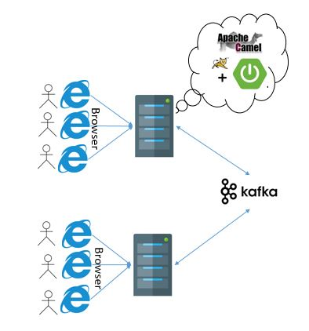

# MySample

This is a sample Chat application developed using Spring boot + Camel + Kafka
This sample requires Kafka server be running.

<pre>
Uses
Spring Boot: For application startup (Uses web starter + thymeleaf)
Kafka : To co-ordinate among multiple servers (For test purpose)
Camel : To communicate with kafka
</pre>

<p align="center">

</p>

#### Step 1:
Configure the Kafka server details in application.properties
#### Step 2:
Build the war using 
``` mvn install ``` command
#### Step 3: 
Start the Kafka server
#### Step 4:
Start the Spring boot application using 
``` java -jar target/MyChatAppxxxx.war ```
Once the spring boot is started, by using the URL
http://localhost:8080 you should be able to enter to the common chat room.
